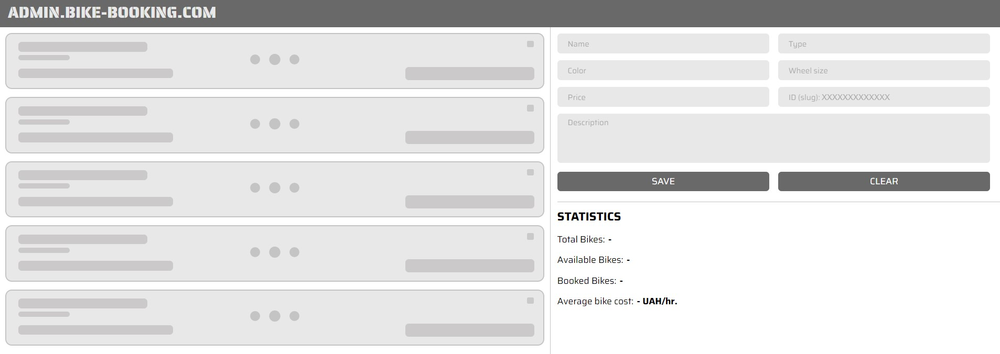

# Приложение "Bicycle"

- Работает по ссылке:
  [https://bicyclecom.netlify.app/](https://bicyclecom.netlify.app/)
- Сервер работает на хосте:
  [http://localhost:8080/bicycles](http://localhost:8080/bicycles)
- Запуск сервера через команду `npm run server`.
- Репозиторий проекта:
  [https://github.com/Maximusvin/bicycle](https://github.com/Maximusvin/bicycle)

1. Стейт реализован на Redux с использованием `Redux Toolkit`. В приложении
   можно было обойтись и контекстом, но реализовал на Редаксе с ипользованием
   ассинхронных запросов для получения и отправки запросов на сервер, а также,
   использовал патерн получения данных с сервера (request, success, error).
2. Реализована страница 404 если юзер введет в адресной строке набор символов,
   который не отвечает основным route приложения.
3. Данные приходят с локального сервера, который реализован с помощью
   `json-server` и запускается на порте 8080.
4. Реализована адаптивная верстка под различные разрешения (мобайл, таблет,
   десктоп).
5. Форма реализована с помощью библиотеки `react-hook-form`. Валидация - с
   помощью библиотеки `yup`. Поля валидируются в соответствии с техническим
   заданием.
6. Получение запросов реализовано с помощью библиотеки `axios`. Сами запросы
   вынесены в отдельный файл в папке `services`.
7. Настроена мемоизация селекторов для оптимизации приложения с помощью
   библиотеки `reselect`. Все вычисления для компонента статистики производяться
   в селекторах.
8. Стилизация компонентов реализована с помощью библиотеки `styled-components`.
9. Проект задеполен на хостинг `Netlify`.
10. Реализован компонент и функционал скелетона при загрузке и получении данных
    с сервера: . Отображается до момента
    рендера списка полученных данных с сервера:
11. Компоненты разбиты по логическим блокам (Хедер, футер, основной контент,
    список велосипедов, форма и статистика).
12. Дизайн максимально соответствует макету приложения.
13. Если данные с сервера не получены - отображается страница-заглушка с
    инструкциями для пользователя.
